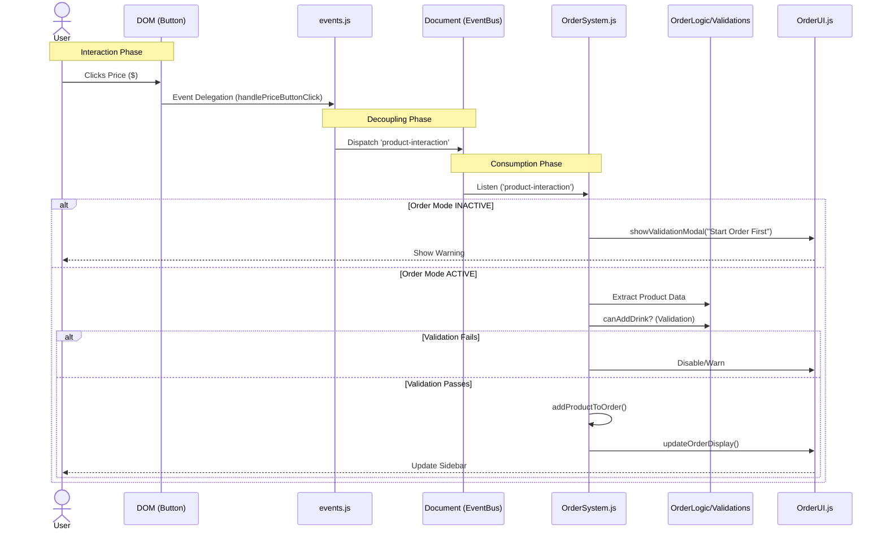

# System Architecture & Radiography

## 🗺️ High-Level Map ("The Organigram")

This document serves as the **Radiography of the System**. It maps how data flows from the database to the screen, and how user actions travel through the code to update the logic.

> **💡 Interactive Map**: Click on the nodes in the diagram below to jump to the corresponding file details.

### 1. Data Flow: From Cloud to Pixel
How the Menu gets rendered on the screen.

```mermaid
graph TD
    subgraph Infrastructure [Data Layer]
        DB[(Supabase Cloud)]
        Adapter[SupabaseAdapter.js]
        Repo[ProductRepository]
    end

    subgraph Application [App Logic]
        Init[AppInit.js]
        DataService[product-data.js]
    end

    subgraph UI [Interface Layer]
        Renderer[ProductRenderer.js]
        DOM_Grid[DOM: Product Grid]
        DOM_Table[DOM: Product Table]
    end

    %% Connections
    Init -- 1. Initialize --> DataService
    DataService -- 2. Request Data --> Repo
    Repo -- 3. Query --> Adapter
    Adapter -- 4. Fetch JSON --> DB
    DB -.-> Adapter
    Adapter -.-> Repo
    Repo -.-> DataService
    DataService -- 5. Pass Products --> Renderer
    Renderer -- 6. Render HTML --> DOM_Grid
    Renderer -- 6. Render HTML --> DOM_Table

    %% Styling
    style DB fill:#333,stroke:#fff
    style Init fill:#2d6a4f,stroke:#fff,color:#fff
    style Renderer fill:#1d3557,stroke:#fff,color:#fff

    %% Interactive Links
    click Adapter "#infraestructura-the-backend-connector" "View Adapter Details"
    click Repo "#dominio-entities--interfaces" "View Domain Details"
    click Init "#infraestructura-the-backend-connector" "View Init Details"
    click DataService "#infraestructura-the-backend-connector" "View Data Provider Details"
    click Renderer "#interface-layer-the-front" "View Renderer Details"
```

---

### 2. Event Flow: From Click to Cart
What happens when a user clicks a price?

---

## 🗂️ Complete System Inventory (The Census)

### 🖥️ Interface Layer (The Front)
*Where the user interacts.*
- `Interfaces/web/ui-adapters/components/product-table.js`: **[Render]** Draws the menu.
- `Interfaces/web/ui-adapters/components/order-system.js`: **[Logic]** The Cart brain.
- `Interfaces/web/ui-adapters/components/OrderUI.js`: **[View]** Sidebars & Modals controller.
- `Interfaces/web/ui-adapters/components/ModalSystem.js`: **[Builder]** Unified Modal Engine.
- `Interfaces/web/ui-adapters/components/NavigationDrawer.js`: **[Left Drawer]** specialized controller.
- `Interfaces/web/ui-adapters/components/OrderDrawer.js`: **[Right Drawer]** specialized controller.
- `Interfaces/web/ui-adapters/components/SettingsDrawer.js`: **[Settings Drawer]** specialized controller.
- `Interfaces/web/ui-adapters/components/OrderLogic.js`: **[Math]** Calculations & State.
- `Interfaces/web/ui-adapters/components/order-system-validations.js`: **[Rules]** Mixer validation logic.
- `Interfaces/web/ui-adapters/screens/screen-manager.js`: **[Nav]** Handles screen switching.
- `Interfaces/web/ui-adapters/managers/SidebarManager.js`: **[Coordinator]** Global sidebar state.

### 🧠 Application Core (The Service)
*Business logic independent of the web.*
- `Aplicacion/services/OrderCore.js`: **[Model]** Pure Cart data structure.
- `Aplicacion/use-cases/LoadCocktailsUseCase.js`: **[Action]** Specific fetching logic.

### 🏗️ Infrastructure (The Backend Connector)
*Talking to the outside world.*
- `Infraestructura/adapters/SupabaseAdapter.js`: **[DB]** Main Supabase connector.
- `Infraestructura/data-providers/product-data.js`: **[Service]** Data fetching wrapper.
- `Shared/config/app-init.js`: **[Boot]** Initialization sequence.
- **Data Robustness**: `ProductDataAdapter.js` implements native mapping for `cortes_de_carne`, ensuring resilience during DB table renames.
- `Shared/config/constants.js`: **[Config]** Global constants & enums.

### 🔧 Shared & Utilities (The Toolbox)
- **State Management**: `Shared/modules/product-table/state.js`
- **Events**: `Shared/modules/product-table/events.js`
- **Helpers**: 
  - `Shared/utils/calculationUtils.js` (Math)
  - `Shared/utils/diUtils.js` (Dependency Injection)
  - `Shared/utils/domUtils.js` (Safe DOM manipulation)
  - `Shared/utils/logger.js` (Console Logs)
- **Utilities (CSS)**:
  - `Shared/styles/utilities/_utils.scss`: **[The Utility Belt]** Spacing, Flexbox, Visibility.
  
### 🏛️ Dominio (Entities & Interfaces)
- `Dominio/entities/`: Core definitions (Cocktail, Food, etc).
- `Dominio/ports/`: Interfaces for Repositories.

### 🎨 Styling & Visuals (The Skin)
*Modern SCSS Architecture (ITCSS-ish).*
- **Entry Point**: `Shared/styles/main.scss` (The root).
- **Tools**: `Shared/styles/tools/_mixins.scss` (The Orchestrator).
- **System (New Architecture)**: 
  - `Shared/styles/settings/_tokens.scss`: **[The DNA]** Spacing, Colors, Elevations.
  - `Shared/styles/components/_button-system.scss`: **[The Action System]**.
  - `Shared/styles/components/_modal-system.scss`: **[The Modal Foundation]**.
  - `Interfaces/web/ui-adapters/components/ModalSystem.js`: **[The Builder Engine]**.
- **Legacy (Deprecated/Transitioning)**:
  - `Shared/styles/components/_modals.scss` (Old static modals).
  - `Shared/styles/components/_modals_custom.scss` (Partially migrated).
- **Views**:
  - `Shared/styles/views/_view-grid.scss` (The Grid).
  - `Shared/styles/views/_view-table.scss` (The logic-heavy Tables).
- **Docs**: See `docs/VISUAL_MAP.md` for the visual radiography.

- **Docs**: See `docs/VISUAL_MAP.md` for the visual radiography.

### 🏠 The Layout Engine (Grid Shell)
*The Skeleton of the App (Desktop 1280px+).*
- **Shell**: `Shared/styles/layout/_layout-shell.scss` (3-Column Grid).
- **Manager**: `ui-adapters/managers/SidebarManager.js` (State Controller).
- **Sidebars**: `Shared/styles/layout/_sidebars.scss` (Layer Definitions).

---

## 🏗️ Core Modules Breakdown

### 5. The Grid Shell (Protocol Phoenix)
- **Source**: `_layout-shell.scss` & `SidebarManager.js`
- **Concept**: A "True Grid" system that replaces legacy flexbox hacks on Desktop.
- **Structure**: 
    - **Col 1 (80px)**: Navigation Spacer / Overlay Trigger.
    - **Col 2 (1fr)**: Main Content (Elastic).
    - **Col 3 (0px -> 350px)**: Order Sidebar (Persistent/Sticky).
- **Logic**: 
    - `SidebarManager` detects "Persistent" sidebars (Order).
    - If active, it expands Col 3 to 350px.
    - If Overlay Sidebars (Settings) open, it **preserves** this grid state.
- **Natural Grid Traits**: 
    - `.sys-grid-5`: Enforces exactly 5 columns on desktop. Ideal for 10-item selections (2x5 layout).

### 6. The Modal Engine (The Builder)
- **Source**: `ui-adapters/components/ModalSystem.js` & `OrderUI.js`
- **Concept**: A centralized Builder Pattern for creating consistent, configuration-driven modals.
- **Refactor (Dec 2025)**:
    - **Natural Configuration**: All styles delegated to `_modal-system.scss` (Utility classes).
    - **Zero Inline Styles**: No direct style manipulation in JS.
    - **Visuals**: Static Cyan Glow (Premium) & Symmetric Buttons (`btn-contrast`).
    - **Unified Launch Protocol**: `OrderUI.js` implements `_launchCustomizationModal`, standardizing the Confirmation-First layout and simplified titles for all product types.

### 1. Product Rendering
- **Source**: `ui-adapters/components/product-table.js`
- **Responsibility**: Takes a list of products and generates HTMLstrings.
- **Key Function**: `renderCategory(categoryName)`

### 2. Event Handling (" The Bridge")
- **Source**: `Shared/modules/product-table/events.js`
- **Responsibility**: Listens for raw clicks, sanitizes them, and announces them to the system.
- **Rule**: It does **NOT** know about the Cart logic. It only reports "User clicked Product X".

### 3. The Order Brain
- **Source**: `ui-adapters/components/order-system.js`
- **Responsibility**: The central hub. Listens to events, checks rules, modifies state.
- **Helpers**:
    - `OrderLogic.js`: Pure calculations (Totals, Metadata).
    - `OrderSystemValidations.js`: The "Rule Book" (e.g., 5 Sodas vs 2 Pitchers).
    - `OrderUI.js`: DOM manipulation for the sidebar and modals.

### 4. Code Hygiene & Rules
- **Ghost Files**: Run `node tools/detect-clones.cjs` to find duplicates.
- **Imports**: Run `node tools/map-imports.cjs` to find unused files.
- **Business Rules**: See `docs/BUSINESS_RULES.md` for specific logic constraints.

## 🛠️ Build Pipeline & Integrity (The Guards)
*Automated systems that protect the project health.*

### 🛡️ SCSS Integrity Guard
- **Source**: `tools/vite-plugin-scss-audit.js`
- **Trigger**: Runs on `npm run dev` and `npm run build`.
- **Mission**: Ensuring strict 1-to-1 mapping between physical SCSS files and `main.scss`.
- **Behavior**: 
  - Scans `Shared/styles/` recursively.
  - Parses `main.scss` imports.
  - **FATAL ERROR** if any file exists but is not imported (preventing "Ghost Styles").

### 🐶 Husky (The Gatekeeper)
- **Trigger**: `git commit`
- **Action**: Runs `npm run build:css`.
- **Purpose**: Prevents "Deformed UI" on deployment by forcing CSS compilation before code leaves the local machine.
- **Hook**: `.husky/pre-commit` -> `git add Shared/styles/main.css`.

### ⚡ Developer Experience (DX)
- **Concurrently**: 
    - **Command**: `npm run dev`
    - **Purpose**: Runs `vite` (App Server) and `sass --watch` (CSS Compiler) simultaneously in one terminal.
    - **Benefit**: Real-time CSS updates without manual rebuilds.

### ☁️ Deployment Strategy (The CDN)
- **Supabase JS**: Uses `esm.sh` (instead of jsdelivr) to ensure correct ESM bundling of complex dependencies (`AuthClient`).
- **CSS**: Pre-compiled `main.css` linked in `index.html`.
