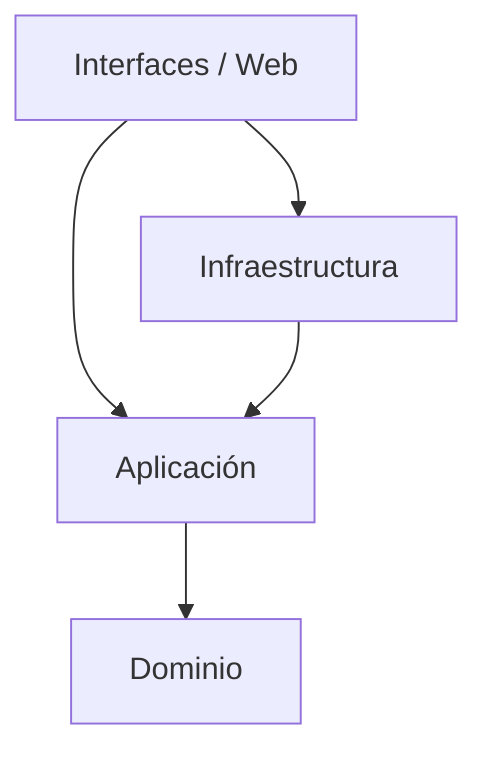
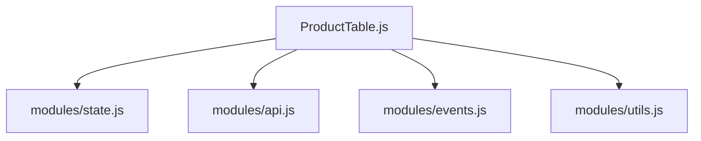

# Arquitectura del Sistema (Clean Architecture)

Este documento describe la arquitectura global del proyecto, basada en principios de **Clean Architecture** y Modularidad.

## 🏗️ Estructura Global

El sistema se divide en capas concéntricas con reglas de dependencia estrictas:

### 1. Capa de Infraestructura (`Infraestructura/`)
Contiene las implementaciones técnicas concretas y adaptadores a servicios externos.
- **Adapters** (`Infraestructura/adapters/`):
    - `SupabaseAdapter.js`: Comunicación directa con la BD Supabase.
    - `ProductDataAdapter.js`: Normalización de datos crudos a entidades de dominio.
    - `BaseAdapter.js`: Clase base para manejo de errores y conexión.

### 2. Capa de Interfaces (`Interfaces/`)
Maneja la interacción con el usuario y la presentación (UI).
- **Web UI Adapters** (`Interfaces/web/ui-adapters/`):
    - **Components**: Lógica de widgets (`product-table.js`, `OrderUI.js`).
    - **Screens**: Gestión de pantallas (`screen-manager.js`).
    - **Modules**: Subsistemas lógicos (`modules/state.js`, `api.js`).

### 3. Capa de Aplicación (`Aplicacion/`)
(En desarrollo) Contiene los Casos de Uso puros y Servicios de aplicación.

---

## 🧩 Subsistema: Product Table
Ubicación: `Interfaces/web/ui-adapters/components/product-table.js`

Este componente sigue un patrón de **Orquestador Modular Interno** para manejar la complejidad de la visualización mixta (Grid/Table).

### Diagrama Interno

### Roles de Módulos
1.  **Orquestador (`product-table.js`)**: Punto de entrada. Renderiza HTML y coordina.
2.  **API (`modules/api.js`)**: Abstrae la llamada a `ProductDataAdapter`.
3.  **State (`modules/state.js`)**: Gestiona `viewMode` (Grid/Table) y estado de carga.
4.  **Events (`modules/events.js`)**: Delegación de eventos (clics en productos, filtros).
5.  **Utils (`modules/utils.js`)**: Helpers puros de formateo.

---

## 🔌 Sistema de Legacy Integration

Algunos componentes antiguos conviven con la nueva arquitectura mediante adaptadores o ubicación en `Interfaces`:
- `order-system.js`: Lógica legacy del carrito de compras (Activo, en migración a `OrderLogic.js`).
- `_legacy.css`: Estilos antiguos encapsulados para no romper la UI mientras se migra a BEM.
